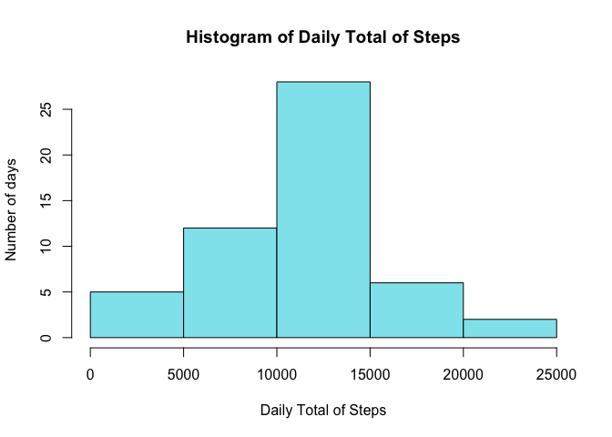
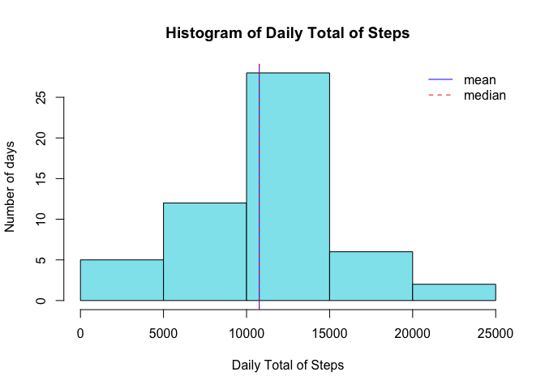
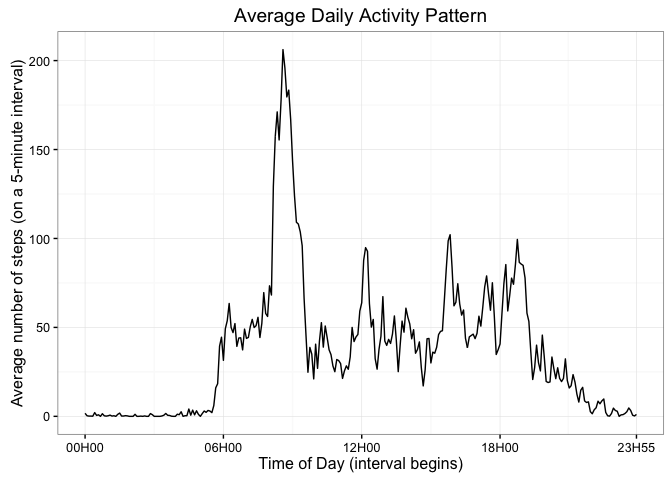
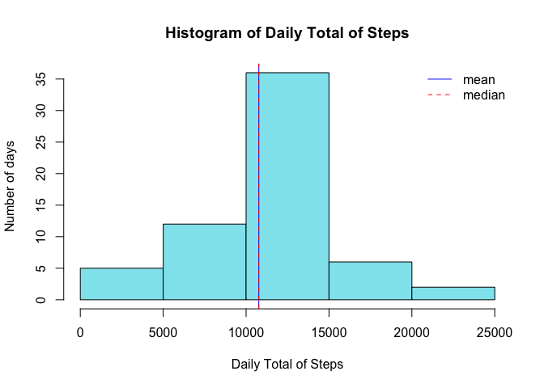
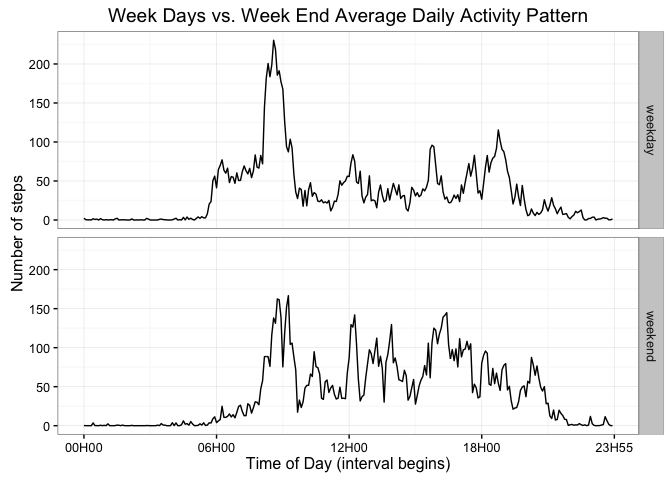

# Reproducible Research: Peer Assessment 1
## Context and purpose of the study

In the context of this 1st Peer Assessment of the Reproducible Research Course, we will study here a set of data (number of steps taken in 5 minute intervals each day) captured during two months (october and november 2012) from a personal activity monitoring device. 
The purpose of the analysis mainly focusses on two dimensions of these data : 

* **the daily total number of steps** taken per day (*histogram, mean, median*). A specific attention will be brought to the missing datas and the impact of their imputation on that analysis.  
* **the average number of steps taken 5-minute interval** throughout the day (*average daily activity pattern*) and the differences that may occur between weekdays and weekends.  


## Loading and preprocessing the data
For this first phase of our analysis in order to load, explore and preprocess the data, we will proceed with the following steps :  

&nbsp;&nbsp;&nbsp;&nbsp;  1 **Explicit the libraries used**  
&nbsp;&nbsp;&nbsp;&nbsp;  2 **Download and read the data**  
&nbsp;&nbsp;&nbsp;&nbsp;  3 **Explore the data**  
&nbsp;&nbsp;&nbsp;&nbsp;  4 **Preprocess the data to facilitate our analysis**   
  
### 1. Libraries used  
For this analysis, we will use the 2 following libraries : `data.table` and `ggplot2`.


```r
library(data.table)
library(ggplot2)
```


### 2. Download and read the data
Although the data was available in the github repository, we chose here (for good practice) to download the original data set and keep track of the time of download.


```r
fileUrl <- "https://d396qusza40orc.cloudfront.net/repdata%2Fdata%2Factivity.zip"        # source url
download.file(fileUrl,destfile="activity.zip", method="curl")                           # download the file
unzip ("activity.zip")                                                                  # unzip the file

dateDownloaded <- date()                                                                # store download date
dateDownloaded                                                                          # print date
```

```
## [1] "Sat Jul  9 19:45:24 2016"
```

```r
activity_data <- fread("activity.csv")                                                  # read as data.table
```

### 3. Explore the data
The function `str` will give us a quick overview of the data (number of variables and observations, type of the variables).


```r
str(activity_data)
```

```
## Classes 'data.table' and 'data.frame':	17568 obs. of  3 variables:
##  $ steps   : int  NA NA NA NA NA NA NA NA NA NA ...
##  $ date    : chr  "2012-10-01" "2012-10-01" "2012-10-01" "2012-10-01" ...
##  $ interval: int  0 5 10 15 20 25 30 35 40 45 ...
##  - attr(*, ".internal.selfref")=<externalptr>
```

There are 2 things that come to immediate attention and need further exploration :  
&nbsp;&nbsp;&nbsp;&nbsp;    a. The **date variable** is not of `Date` type  
&nbsp;&nbsp;&nbsp;&nbsp;    b. The **interval variable** is not a time serie  

**Note** that NAs (and we can spot right away there are some) will be explored further in a dedicated section **Imputing missing values**.

#### &nbsp;&nbsp;&nbsp;3a. Exploring the `date` variable
The `date` variable is currently an `int` and converting it to a type `Date` will enable further analysis (use of specific function `weekdays()` for example)

#### &nbsp;&nbsp;&nbsp;3b. Exploring the `interval` variable
We also note that the variable `interval` (an `int`) is actually an identifier of the interval. Its semantic corresponds to the **time of day** the 5-minute interval started. The `int` **150** actually means **01H50**.  
The consequence is that if we were to lay out those intervals `int` (actually discrete ids) on an axis, we would **not** get a time serie regularly spaced through the axis. Let's look indeed at the 15 first values of the interval :


```r
activity_data$interval[c(1:15)]
```

```
##  [1]   0   5  10  15  20  25  30  35  40  45  50  55 100 105 110
```

We note that we **jump** from `55` to `100` although there is a 5 minute interval between `55` (ie 00H55) and `100` (ie 01H00)
So in our preprocessing of the data, we will add a variable `timeofday` that will be the **time of the day in minutes** the 5-min interval began (so from 0 minutes to 1435, that is from 00H00 - interval 0 - to 23H55 - interval 2355-).  
**Note** that although we kept here both variables`interval` and `timeofday`, we can at any time still deduce the `interval` id from the `timeofday` (and reciprocally).

### 4. Preprocess the data
Following from the exploration above, we will  
&nbsp;&nbsp;&nbsp;&nbsp;    a. convert the variable date from type `chr` to type `Date`  
&nbsp;&nbsp;&nbsp;&nbsp;    b. add a variable `timeofday` to represent the time of day (in minutes) the 5-minute interval started.  
The missing data will be imputed further down in the analysis.


```r
activity_data$date <- as.Date(activity_data$date)                     # convert date value into Date type
activity_data$timeofday <- (activity_data$interval %/% 100 * 60) +    # add timeofday variable with time of day 
                                 (activity_data$interval %% 100)      # the interval began (in minutes)
```

As a result, our preprocessed data now looks like this :


```r
str(activity_data)
```

```
## Classes 'data.table' and 'data.frame':	17568 obs. of  4 variables:
##  $ steps    : int  NA NA NA NA NA NA NA NA NA NA ...
##  $ date     : Date, format: "2012-10-01" "2012-10-01" ...
##  $ interval : int  0 5 10 15 20 25 30 35 40 45 ...
##  $ timeofday: num  0 5 10 15 20 25 30 35 40 45 ...
##  - attr(*, ".internal.selfref")=<externalptr>
```

## What is mean total number of steps taken per day?

We wil proceed here in 4 steps :  
&nbsp;&nbsp;&nbsp;&nbsp;  1 **Filter out NAs from our set of data**  
&nbsp;&nbsp;&nbsp;&nbsp;  2 **Calculate the daily total number of steps**  
&nbsp;&nbsp;&nbsp;&nbsp;  3 **Represent the result as a histogram of the total number of steps taken each day**  
&nbsp;&nbsp;&nbsp;&nbsp;  4 **Place and report on that histogram mean and median total number of steps taken per day**  

### 1. Filter out NAs
We will operate by prefiltering the data and assign the subsetted data to a new variable `activity_data_noNAs`.  
Note the importance of prefiltering and not just relying on `na.rm` in function `sum`. This would actually biaise the resulting histogram by keeping 8 days that have only NAs thus resulting into a total number of steps of 0 for each of those days (cf section **Imputing missing values** below and my post in the forum on that topic [[tip] filtering out missing value is not all about na.rm ....](https://www.coursera.org/learn/reproducible-research/discussions/all/threads/7IatYEC7Eead6Qo6D3cLkQ)).


```r
activity_data_noNAs <- activity_data[is.na(activity_data$steps)==F,]
```

### 2. Calculate the daily total number of steps
As we are using the library `data.table`, this is achieved simply using the grouping `by` feature on the variable `date` (see [here](https://s3.amazonaws.com/assets.datacamp.com/img/blog/data+table+cheat+sheet.pdf) for a cheat sheet on data analysis with `data.table`).


```r
SumStepsByDay <- activity_data_noNAs[,.(sumsteps = sum(steps)), by=date]
```

### 3. Represent the result as a histogram of the total number of steps taken each day


```r
hist(SumStepsByDay$sumsteps,                        # build histogram on variable sumsteps
     main="Histogram of Daily Total of Steps",      # add main title
     xlab="Daily Total of Steps",                   # add label on x-axis
     ylab="Number of days",                         # add label on y-axis
     col="cadetblue2")                              # add nice blue color
```

<!-- -->

### 4. Place and report on that histogram mean and median
Let's now compute the mean and median of the total number of steps taken per day and add them to our histogram.


```r
MeanStepsByDay <- mean(SumStepsByDay$sumsteps)      # compute mean - no need for na.rm=T as we filtered out NAs
MedianStepsByDay <- median(SumStepsByDay$sumsteps)  # compute median - no need for na.rm=T as we filtered out NAs

hist(SumStepsByDay$sumsteps,                        # build histogram on variable sumsteps
     main="Histogram of Daily Total of Steps",      # add main title
     xlab="Daily Total of Steps",                   # add label on x-axis
     ylab="Number of days",                         # add label on y-axis
     col="cadetblue2")                              # add nice blue color

abline(v=MeanStepsByDay,lty=1, col="blue")          # place mean on histogram
abline(v=MedianStepsByDay,lty=2, col="red")         # place median on histogram

legend(x="topright",                                # add a legend for median and mean
       c("mean","median"), 
       lty=c(1,2), 
       col=c("blue","red"), bty="n")
```

<!-- -->

```r
MeanStepsByDay                                     # report mean
```

```
## [1] 10766.19
```

```r
MedianStepsByDay                                   # remport median
```

```
## [1] 10765
```

We can see that the mean **10766.19** and the median **10765** are very close (not even a step), which explains the 2 vertical lines are superposed when placed on our histogram.

## What is the average daily activity pattern?

As instructed, we will ignore Missing Data here too. We will proceed with 3 steps :  
&nbsp;&nbsp;&nbsp;&nbsp;  1 **Compute the average number of steps taken averaged across all days**  
&nbsp;&nbsp;&nbsp;&nbsp;  2 **Plot the result with a time serie**  
&nbsp;&nbsp;&nbsp;&nbsp;  3 **Find the 5-minute interval that contains the maximum number of steps on average across all the days in the dataset**  

### 1. Compute the average number of steps taken averaged across all days
We will use here too the grouping `by` feature from the library `data.table` but this time on the variable `timeofday` (and not `date`). We chose the variable `timeofday` and not `interval` as we want to use `timeofday` later on as a time serie for the x-axis of our plot.


```r
AvgStepsByInterval <- activity_data_noNAs[,.(avgstepsinterval = mean(steps)), by=timeofday]
```

### 2. Plot the result with a time serie
We will use here the library `ggplot` and make sure we use the variable `timeofday` for x-axis. This variable beeing in minutes, for sake of readibility, we will label 5 main break points of that axis with HoursMinutes rather than total minutes : 0 minutes will be 00H00, 360 minutes will be 06H00, 720 minutes will be 12H00, 1080 will be 18H00 and 1435 will be 23H55.


```r
g <- ggplot(AvgStepsByInterval,                                                  # initiate with aesthetics
            aes(timeofday, avgstepsinterval),                                    # time serie timeofday on x-axis
            linetype="1") 
g <- g + theme_bw() +                                                            # change theme
        geom_line() +                                                            # plot as line
        scale_x_continuous(breaks=c(0,360,720,1080,1435),                        # label scales wiht HoursMin
                         labels=c("00H00","06H00","12H00","18H00","23H55")) +
        labs(                                                                   
                title="Average Daily Activity Pattern",                          # add main title
                x="Time of Day (interval begins)",                               # add label on x-axis
                y="Average number of steps (on a 5-minute interval)")            # add label on y-axis
        
print(g)       
```

<!-- -->

### 3. Find the 5-minute interval that contains the maximum number of steps on average across all the days in the dataset
Let's now find for which `timeofday` we have a maximum value in the variable `avgstepsinterval` from the `AvgStepsByInterval` data set we computed as a first step (average by interval across all the days in the data set) .


```r
                                                                # find the value timeofday
MaxTimeOfDayMinutes <- AvgStepsByInterval[which.max(AvgStepsByInterval$avgstepsinterval),]$timeofday 
MaxTimeOfDay <- paste(MaxTimeOfDayMinutes %/% 60,               # convert into HoursMinutes
                      MaxTimeOfDayMinutes %% 60,sep="H") 
MaxIntervalId <- paste(MaxTimeOfDayMinutes %/% 60,              # convert into interval id
                      MaxTimeOfDayMinutes %% 60,sep="")             

MaxTimeOfDay                                                    # display Time of Day in xxHxx format
```

```
## [1] "8H35"
```

```r
MaxIntervalId                                                   # display corresponding interval id
```

```
## [1] "835"
```

We could also wonder what is that maximun number of steps :

```r
MaxAvgSteps <- max(AvgStepsByInterval$avgstepsinterval)         # find the maximum number of steps
MaxAvgSteps                                                     # display maximum number of steps
```

```
## [1] 206.1698
```
To summarize, the 5 minute interval (on average across all the days in the datase) that contains the maximum number of steps is the interval with the id **835** which actually starts at **8H35** and corresponds to **206.1698** steps.

## Imputing missing values
We will examine here the missing values in our source data set, define a strategy to impute new values to replace them and study the impact the impact of imputing missing data on the estimates previously done. We will proceed with the following 4 steps :  
&nbsp;&nbsp;&nbsp;&nbsp;  1 **Calculate and report the total number of missing values**  
&nbsp;&nbsp;&nbsp;&nbsp;  2 **Devise a strategy for filling in all of the missing values in the dataset**  
&nbsp;&nbsp;&nbsp;&nbsp;  3 **Create a new dataset equal to the original dataset but with the missing data filled in**    
&nbsp;&nbsp;&nbsp;&nbsp;  4 **Reproduce the previous histogram on the new dataset with mean and median**   
&nbsp;&nbsp;&nbsp;&nbsp;  5 **Conclude on the impact of imputing missing data** 

### 1. Calculate and report the total number of missing values
Let's count rows with missing values (NAs) and check where they are. Are they on specific days, specific intervals or about anywhere ?


```r
number_NAs <- sum(is.na(activity_data$steps))                   # count NAs
number_NAs                                                      # display NAs
```

```
## [1] 2304
```

```r
table(activity_data[is.na(activity_data$steps)==T,]$date)       # display how many NAs for each day
```

```
## 
## 2012-10-01 2012-10-08 2012-11-01 2012-11-04 2012-11-09 2012-11-10 
##        288        288        288        288        288        288 
## 2012-11-14 2012-11-30 
##        288        288
```

We have **2304** NAs and since there are **288** intervals by day we see they are on all intervals of 8 different days.  
This is very important to note as if we were to sum the steps using `sum( ,na.rm=T)` hoping to filter out NAs this way, this would actually result in a `0` for those days (cf my post in the forum on that topic [[tip] filtering out missing value is not all about na.rm ....](https://www.coursera.org/learn/reproducible-research/discussions/all/threads/7IatYEC7Eead6Qo6D3cLkQ))

### 2. Devise a strategy for filling in all of the missing values in the dataset
Since the missing values are all on 8 specific days and for all intervals of the day, we chose as a strategy to replace the NA value (for each interval of the day with NA) by **the average number of steps for that interval computed on all the days** (this average being computed on the data set with missing values filtered out).

### 3. Create a new dataset equal to the original dataset but with the missing data filled in
Since we computed those average number of steps in the data table `AvgStepsByInterval` when plotting the daily activity pattern, we will simply :   

* use a merge to associate for each `timeofday` the matching average number in `AvgStepsByInterval`
* impute for each value `steps` that is NA that average number
* delete the variable `avgstepbyinterval` in the data table as it is no longer needed
  

```r
activity_data_imputed <- merge(activity_data,                                 # associate to each timeofday 
                               AvgStepsByInterval,                            # the matching avgstepsinterval
                               by="timeofday")      
activity_data_imputed$steps <- ifelse(is.na(activity_data_imputed$steps),     # when steps value is NA 
                                      activity_data_imputed$avgstepsinterval, # replace steps value by
                                      activity_data_imputed$steps)            # avgstepsinterval 
 
activity_data_imputed[, avgstepsinterval := NULL]                             # delete variable avgstepsinterval
```

### 4. Reproduce the previous histogram on the new dataset with mean and median
We will follow here the same steps followed when building the previous histogram, but using this time the set of data with the missing data filled in we just built, that is `activity_data_imputed`.

```r
SumStepsByDay2 <- activity_data_imputed[,             # sum steps by date for all days
                                        .(sumsteps = sum(steps)),
                                        by=date]


MeanStepsByDay2 <- mean(SumStepsByDay2$sumsteps)      # compute mean
MedianStepsByDay2 <- median(SumStepsByDay2$sumsteps)  # compute median

hist(SumStepsByDay2$sumsteps,                         # build histogram on variable sumsteps
     main="Histogram of Daily Total of Steps",        # add main title
     xlab="Daily Total of Steps",                     # add label on x-axis
     ylab="Number of days",                           # add label on y-axis
     col="cadetblue2")                                # add nice blue color

abline(v=MeanStepsByDay2,lty=1, col="blue")           # place mean on histogram
abline(v=MedianStepsByDay2,lty=2, col="red")          # place median on histogram

legend(x="topright",                                  # add a legend for median and mean
       c("mean","median"), 
       lty=c(1,2), 
       col=c("blue","red"), bty="n")
```

<!-- -->

```r
MeanStepsByDay2                                       # report mean
```

```
## [1] 10766.19
```

```r
MedianStepsByDay2                                     # remport median
```

```
## [1] 10766.19
```

### 5. Conclude on the impact of imputing missing data on the previous estimate
**Concerning the histogram**, we obviously see that the 8 missing days (days with NAs for all interval and now filled in with the average by interval across all days) are now counted in the middle of the new histogram in the 1000-1500 bucket. This is totally to be expected since we filled in with averaged data. This also explains that the other buckets remained the same.  
**Concerning Mean and Median**, let's compare them as computed for the data set with missing values filtered vs with missing values imputed.
  
| Comparison                   | Mean                                    |Median                                  |
| ---------------------------- |-----------------------------------------| ---------------------------------------|
| Missing Values filtered out  | 10766.19      |10765                    |
| Missing Values imputed       | 10766.19     |  10766.19 |

We can see that the mean did not change whereas the median is now (for the set with missing values imputed) equal to the median.  
This is probably due to the fact that : 

* we were careful to filter NAs before computing our first histogram, therefore we did not introduced 8 days with a sum of 0 steps in our first histogram
* we used a strategy that filled in the NAs with the average for all interval through all of the days, so when those 8 days were kept in the full set with missing values imputed, they had average values for each interval that did not affect the whole average.

## Are there differences in activity patterns between weekdays and weekends?
We define for this section weekdays as being the days of the week except Saturday and Sunday (which are the week end days).  
Our objective here is to breakdown (facet) the daily activity pattern we plotted above into 2 panels (one for weekdays, one for weekends).  
We will details here the 2 following steps :  
&nbsp;&nbsp;&nbsp;&nbsp;  1 **Create a factor to distinguish week end days from other days of the week**  
&nbsp;&nbsp;&nbsp;&nbsp;  2 **Plot the daily activity patterns breaking down by week days vs week ends**  
    
### 1. Create a factor to distinguish week end days from other days of the week
We will base this factor on the dataset with the filled-in missing values `activity_data_imputed`.  
The new factor created (based on a logical vector produced through the function `weekdays()`) will be added as a new variable `weekdays` to our data set `activity_data_imputed`.

```r
Sys.setlocale("LC_ALL", 'en_US.UTF-8')            # Make sure things will be in english .... (I am in Quebec ...)
```

```
## [1] "en_US.UTF-8/en_US.UTF-8/en_US.UTF-8/C/en_US.UTF-8/fr_CA.UTF-8"
```

```r
                                                  # Create factor
factorWeekDays <- factor(weekdays(activity_data_imputed$date) %in% c("Saturday","Sunday")) 
levels(factorWeekDays) <- c("weekday","weekend")

activity_data_imputed$weekdays <- factorWeekDays # Add the new factor as a variable weekdays to facet on it
```

### 2. Plot the daily activity patterns breaking down by week days vs. week ends
In order to breakdown by weekday vs weekend, we will use here again the `by` feature of `data.table` to compute the avg by `weekdays` by `timeofday`. We will then use the facet principle of `ggplot` to display along 2 facets (`weekday` vs. `weekend`)

```r
AvgStepsByIntervalbyWeekDay <- activity_data_imputed[,                         # avg steps by timeofday + weekdays
                                                     .(avgstepsinterval = mean(steps)),
                                                     by=.(timeofday,weekdays)]

g <- ggplot(AvgStepsByIntervalbyWeekDay,                                         # initiate with aesthetics
            aes(timeofday, avgstepsinterval),                                    # time serie timeofday on x-axis
            linetype="1") 
g <- g + theme_bw() +                                                            # change theme
        facet_grid(weekdays~.) +                                                 # facet by weekdays
        geom_line() +                                                            # plot as line
        scale_x_continuous(breaks=c(0,360,720,1080,1440),                        # label scales wiht HoursMin
                           labels=c("00H00","06H00","12H00","18H00","23H55")) + 
        labs(                                                                    # add title, x/y-axis labels 
                title="Week Days vs. Week End Average Daily Activity Pattern",
                x="Time of Day (interval begins)",
                y="Number of steps")                                             # use the same label as sample provided 

print(g)
```

<!-- -->


We can see that the Average Daily Activity Pattern is slightly different on Week Ends vs Week Days with definitively more activity during the Week Ends (see below for an example of a difference).

## Extras - One step (if I dare ;-) ) further
Just for the fun and as extra, let's see what is the max interval for week ends vs week days


```r
AvgStepsByIntervalbyWeekDay[,                                   # add a variable with the max by weekdays
                            nmax := max(avgstepsinterval), 
                            by=weekdays]       
MaxTime <- AvgStepsByIntervalbyWeekDay[avgstepsinterval==nmax]  # subset on intervals that match that max

MaxTime[, interval := paste(timeofday %/% 60,                   # convert timeofday in interval id
                            timeofday %% 60,sep="")]
MaxTime[, hourmin := paste(timeofday %/% 60,                    # convert timeofday in HoursMinutes
                           timeofday %% 60,sep="H")]            

MaxTime                                                         # display for week ends vs weekdays
```

```
##    timeofday weekdays avgstepsinterval     nmax interval hourmin
## 1:       515  weekday         230.3782 230.3782      835    8H35
## 2:       555  weekend         166.6392 166.6392      915    9H15
```

Seems like this person as some morning routine sligtly different on week ends (slithgly later and shorter during week ends) :   

* Maximun activity on week days : at **8H35**, **230.4** steps
* Maximum activity on week ends : at **9H15**, **166.6** steps

